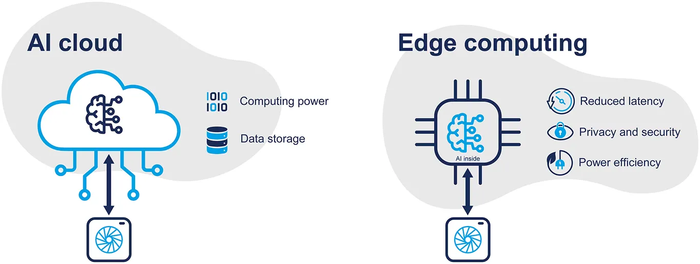

# Optimize and Deploy Deep Learning Models on Edge Devices

This project explores optimization techniques to reduce the computational cost and memory footprint of deep learning models, enabling their deployment on resource-constrained edge devices such as the Raspberry Pi, NVIDIA Jetson Nano, and other embedded or low-power hardware platforms. In this work, we evaluate and test our pipeline specifically on the Jetson Nano.

## 📌 Overview

Deep neural networks (DNNs) have achieved outstanding performance in numerous applications. However, their computational demands hinder deployment on low-power devices. This project proposes a complete pipeline integrating:

- Model pruning (structured and unstructured)
- Quantization (post-training & quantization-aware)
- Low-rank approximations (SVD-based)
- Knowledge distillation (KD)
- TensorRT acceleration

These methods are applied to 5 popular architectures (VGG, MobileNet, NASNet, AlexNet, EfficientNet) and tested on Jetson Nano.

In addition to the five CNN architectures, we deployed real-time applications to further evaluate the effectiveness of the optimization and deployment pipeline on the Jetson Nano. These applications include:

- `YOLOv8s` for real-time object detection

- `MobileNet SSD` for lightweight object detection

- Face detection and recognition, using `facedetect` for detection and `InceptionResNetV1` for generating face embeddings

These practical use cases demonstrate the feasibility and performance benefits of running optimized deep learning models on resource-constrained edge devices.

---

## 📊 Results Highlights

- **MobileNetV2**:  
  From 9.88MB to **0.47MB**, and throughput improved from **31.9 FPS** to **66.1 FPS** (TensorRT + FP16).

- **VGG11**:  
  Achieved **16× speedup** with minimal (2%) accuracy drop using structured pruning and quantization and tensorRT acceleration.

- **YOLOv8s**:  
  Real-time object detection with quantization and KD, while reducing model size and inference time significantly.

- **LLMs on Jetson Nano**:  
  Benchmarked models like TinyLlama and Qwen2.5-0.5B with memory and latency evaluations for edge NLP.

---

## 🔧 Optimization Techniques

| Technique            | Description                                                       |
|----------------------|-------------------------------------------------------------------|
| **Pruning**          | Removes redundant weights or channels to reduce model size       |
| **Quantization**     | Converts FP32 weights to INT8/FP16 for faster inference           |
| **Low-Rank Approx.** | Factorizes large matrices using SVD for compression               |
| **Knowledge Distill.** | Transfers knowledge from a large "teacher" model to a small "student" |
| **TensorRT**         | NVIDIA's high-performance deep learning inference optimizer       |

---

## ⚙️ Deployment Platform

- **Device**: NVIDIA Jetson Nano
- **Power**: 5V 3A MicroUSB
- **Frameworks**: PyTorch, TensorFlow Lite, ONNX, TensorRT
- **OS**: Ubuntu 18.04 with JetPack SDK

---

## 🧑‍💻 Authors

- Ahmed G. Noureddine  
- Khaled W. Metwally  
- Abdelrahman M. ELsayed  
- Mazen W. Diaa  
- Mahmoud M. Gouda  
- Youssef H. Mohamed

---

## 📬 Contact

For questions, suggestions, or collaborations, feel free to open an issue or contact us directly.

---
